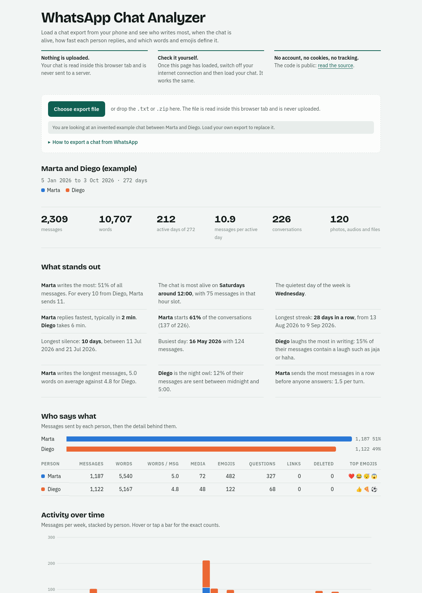

# WhatsApp Chat Analyzer

[](https://github.com/nicolasfeoli/whatsapp-chat-analyzer/actions/workflows/ci.yml)
[](LICENSE)

**[Try it live](https://nicolasfeoli.github.io/whatsapp-chat-analyzer/)**: it opens with an invented example chat, and you can drop your own export on it.

A static page that reads a WhatsApp chat export (`.txt` or `.zip`) and shows who writes most, when the chat is alive, how fast each person replies, and which words and emojis define it.

The chat never leaves the browser tab. There is no backend, and the page's Content-Security-Policy forbids page scripts from opening a network connection.

<picture>
  <source media="(prefers-color-scheme: dark)" srcset="docs/screenshot-dark.png">
  
</picture>

The chat in the screenshot is invented; it is the example the page shows before you load a file.

Not affiliated with, endorsed by, or connected to WhatsApp or Meta.

## Purpose

I wanted to know what one of my group chats looked like from the outside. After years of messages, everyone in it had a theory: who never shuts up, who leaves people on read, who only shows up at two in the morning. Nobody had numbers, so the arguments never ended.

WhatsApp can export a chat as a text file, but the file is thousands of lines with no summary. This page turns it into something you can read in a minute and share with the group:

- **Answers to the arguments.** Who writes most, who starts the conversations, who replies fastest, who answers whom and how fast, who mentions whom, who edits their messages after sending them, on which weekday and at what hour each person mostly writes, whose questions are left hanging, and who sends five messages in a row before anyone answers.
- **The shape of the chat over time.** When it was busiest, when it went quiet, the longest streak and the longest silence, who took over the chat since it began, who has not written in a long time, and the milestones on the way: the 10,000th message and who sent it, the day half of everything had been said, the latest anniversary. A calendar with one square per day shows every year at a glance, down to the single day the chat fell silent or boiled over. Pick a year, the last twelve months or any two dates, and the whole report is counted again for just that stretch.
- **Its personality.** The words, catchphrases and emojis each person uses far more than everyone else, who laughs the most in writing, who answers in one word or one emoji and who writes paragraphs, and who sends the stickers, the photos and the voice notes, and which sites the links lead to, for the chat and for each person. A row of awards near the top hands out the titles: the night owl, the novelist, the opener, each with the number that earned it. And for the word the lists did not pick, a search field: type any word or short phrase and see how many messages contain it, who says it most, and how that changed from month to month.

A chat is also other people's messages, and they never agreed to have them analysed by a stranger's server. So the page is built so that you do not have to trust it: the file is read inside your browser tab and nothing is uploaded. A switch replaces the names with neutral labels and hides message text before you share a screenshot. A button draws the headline numbers as one picture to pass on, with the names or with the labels, and it is drawn inside the tab like everything else. In a large group the report lists the most active people, and another switch lists everyone. Whoever is left out can still be looked up: one section shows a single person of your choice up close, with their numbers, the hours and weekdays they write in, their words, and whom they answer and mention most.

The project had a second purpose. The first version was written by an AI in one sitting, and I wanted to find out how far that code holds up once it is reviewed and held to the standards of code I would put my name on. The next section is what I found.

## How it got here

It started as one AI-generated `index.html` that looked finished. I treated it as a pull request from a stranger: read it, tried to break it, and wrote down what I found. The review turned up twelve problems, among them a crash on large chats and several kinds of iPhone message that were silently dropped.

Each fix landed with a test, the single file was split so the parsing logic could be tested without a browser, and the "nothing is uploaded" claim was turned from a sentence in the footer into something the browser enforces. The code was then rewritten in strict TypeScript, one concern per module, with the old implementation as the behavioural specification. [ROADMAP.md](ROADMAP.md) is the full review: what was fixed, what is still wrong, and the risks of hosting a tool like this publicly.

## What was hard

**A chat export is not a format.** WhatsApp writes the file differently per platform, per phone language and per region, and none of it is documented. The same instant can appear as:

```
[8/31/26, 1:29:57 PM] Ana: hola          iPhone, en-US
31/12/23, 22:00 - Ana: hola              Android, es
[31.12.23, 22:00:15] Ana: hola           iPhone, de
```

The parser takes all of these with one line pattern, then works out the rest from the file as a whole.

**`03/04/24` is ambiguous.** If any date in the file has a number above 12, the order is settled. If none does, the parser reads the file both ways and keeps the reading in which time runs forward; if both do, it keeps the one with the shorter overall span, because the wrong reading puts consecutive days a month apart. Only then does it fall back to the browser's region. The page says which order it chose and offers a switch.

**Invisible characters carry meaning.** iPhone exports put a left-to-right mark (U+200E) in front of anything that is not typed text. The first version dropped every line that carried one, which lost deleted messages, locations and polls along with the system notices. The parser now uses the mark to classify the line: with it, "image omitted" is a photo; without it, someone typed those words.

**Pasted messages look like new ones.** A message that quotes lines from another chat produces lines that match the message pattern. A short run that jumps back in time, from a sender who never appears anywhere else, is folded back into the message it was pasted in.

**Large chats.** Spreading every message into `Math.max(...values)` overflows the stack once a chat is large enough. The fix is a loop; the test builds a 400,000-message chat to keep it fixed. Parsing runs in a Web Worker so the page stays responsive meanwhile.

## Privacy as a constraint, not a promise

A chat export contains messages from people who never agreed to have them analysed, so the design rule is that the text should have no way out of the tab.

- **No backend.** The repo is static files.
- **A Content-Security-Policy with `connect-src 'none'`.** Page scripts cannot fetch, post or open a socket, so a careless addition such as an analytics snippet fails instead of leaking a chat.
- **No third-party requests.** JSZip is bundled into the page's own script at build time and the fonts are kept in `public/fonts/`. Their licence notices ship with the build, in `THIRD-PARTY-LICENCES.txt` and `fonts/`. The built page loads nothing from any other server.
- **Untrusted text is escaped** before it reaches the DOM, and the compiler checks it. Names and messages are attacker-controlled input: anyone in a group chat can set their name. Markup has its own type, `SafeHtml`, which a plain string cannot be assigned to, so a name that was never escaped does not compile.
- **A parse report after every load** states how many messages were read, how many system notices were skipped and how many entries had unreadable dates, so a half-understood file does not pass for a complete one.

The policy is a `<meta>` tag, which leaves gaps: it does not apply inside the worker and cannot stop another site from framing the page. Closing them needs a host that can send HTTP headers; see "Known limits" in the roadmap.

## Run it

Node 22 or newer.

```sh
npm install
npm run dev      # Vite dev server with hot reload
```

To load your own chat: in WhatsApp open a chat, choose Export chat, pick Without media, and drop the file on the page.

```sh
npm run build    # production build in dist/
npm run preview  # serve dist/ locally
```

`dist/` is plain static files with relative URLs, so it can be hosted at a domain root or under a sub-path such as GitHub Pages. It has to be served over HTTP: opened straight from disk, the browser refuses the page's scripts and styles and only the bare shell shows.

The dev server relaxes `connect-src` to its own WebSocket so hot reload works. `index.html` on disk and the build keep `connect-src 'none'`.

## Tests

```sh
npm test               # Vitest, 2,765 tests in 84 files
npm run test:coverage  # the same, with a coverage report in coverage/
npm run check          # type check, lint, formatting, tests with coverage, build
```

The tests mirror `src/`:

- `tests/core` covers parsing and analysis: both platforms, 12 and 24 hour clocks, ambiguous date orders, impossible dates such as 31/02, pasted lines, non-Latin digits, emoji sequences and the 400,000-message chat. `tests/core/known-limits.test.ts` pins the inputs the parser is known to get wrong, so they are not mistaken for regressions.
- `tests/ui` covers the page in a simulated browser (jsdom): every section of the report, the charts and their tooltips, file loading from `.txt` and `.zip`, the size limits, the worker client with its main-thread fallback, and the page controller driving the real `index.html` end to end. Each of those end-to-end tests starts a page of its own. One test renders a chat whose names and messages are markup and checks that no element is created from them.
- `tests/worker` covers how the worker answers requests, including an analysis that throws, and the worker's entry point behind a stand-in for its global scope.
- `tests/project` checks that the licence notices of the bundled libraries ship with the page.

No test runs in a real browser yet, so the Content-Security-Policy and the real Web Worker are checked by hand; see the roadmap.

Every chat line in the tests is invented, and the zips are built inside the tests.

## Layout

| Path                   | What it does                                                                                            |
| ---------------------- | ------------------------------------------------------------------------------------------------------- |
| `src/core/`            | No DOM and no browser globals; shared by the page, the worker and the tests                             |
| `src/core/parsing/`    | Line pattern, invisible characters, message kinds, date order, pasted lines                             |
| `src/core/analysis/`   | Per-person statistics, words, emojis, link sites, streaks, silences, milestones, the word search        |
| `src/ui/`              | `main.ts` entry, the page controller, file loading, the worker client, periods, the rules of the awards |
| `src/ui/sections/`     | One module per section of the report                                                                    |
| `src/ui/charts/`       | Timeline, heatmap, calendar, horizontal bars, the grid of people and the bar strips                     |
| `src/ui/summary-card/` | The summary image: what it says, where each text goes, the canvas shell and the download                |
| `src/worker/`          | Runs the core off the main thread, behind a typed message protocol                                      |
| `src/styles/`          | Styles, light and dark                                                                                  |
| `index.html`           | Page shell and Content-Security-Policy                                                                  |
| `public/`              | Fonts, favicon and third-party licence notices, copied to the build unchanged                           |
| `tests/`               | Mirrors `src/`; `tests/fixtures/` holds the builders for invented chats                                 |

No UI framework: the report is built as escaped HTML strings, and the charts are hand-written SVG and CSS grid. The only runtime dependency is JSZip.

## Engineering standards

- **TypeScript in strict mode**, plus `noUncheckedIndexedAccess`, `exactOptionalPropertyTypes`, `noImplicitOverride`, `noFallthroughCasesInSwitch`, `noImplicitReturns`, `noPropertyAccessFromIndexSignature`, `noUnusedLocals` and `noUnusedParameters`. `src/core` is compiled a second time without the DOM library, so a `document` or `window` in the core is a compile error. The worker entry is checked on its own, against the Web Worker library and without the DOM types.
- **ESLint** with the strict and stylistic type-checked rule sets of typescript-eslint. On top of them: explicit return types, no `any`, no non-null assertions, exhaustive `switch` statements, no nested ternaries, one variable per declaration, and no identifier shorter than three characters apart from `i`, `j`, `x` and `y`. `src/core` may not import from the page or the worker.
- **Prettier** for formatting; the check fails on any unformatted file.
- **Coverage thresholds** enforced by the test run: 90% of `src/core`, 85% of `src/ui` and 85% of `src/worker`, each measured on its own for lines, branches, functions and statements. The suite currently covers 99% of statements.
- **CI** runs `npm run check` on Node 22 and 24 for every pull request and every push to `main`, and keeps the coverage report as an artifact. Every push to `main` that passes the same check is also deployed to GitHub Pages.

[CONTRIBUTING.md](CONTRIBUTING.md) has the conventions these tools cannot check.

## What it supports

- Android and iPhone exports, 12 or 24 hour clocks
- English and Spanish in full; Portuguese, German, French and Italian on a best-effort basis
- Day/month, month/day and year-first dates
- `.zip` exports

## Status

Tested against invented chats in every supported layout and against one real iPhone export. Android and the best-effort languages have not been checked against real exports yet. Known limits and planned work are in [ROADMAP.md](ROADMAP.md).

## Contributing

Never commit or attach a real chat. `.gitignore` blocks the usual export filenames, but check `git status` before every commit. Test fixtures and bug reports must use invented lines. Setup, code style and test conventions are in [CONTRIBUTING.md](CONTRIBUTING.md).

## Licence

[MIT](LICENSE). The fonts keep their own licences; see [public/fonts/README.md](public/fonts/README.md). JSZip is used under the MIT licence; its notice and those of the libraries inside it are in [public/THIRD-PARTY-LICENCES.txt](public/THIRD-PARTY-LICENCES.txt), which is copied into the build.
